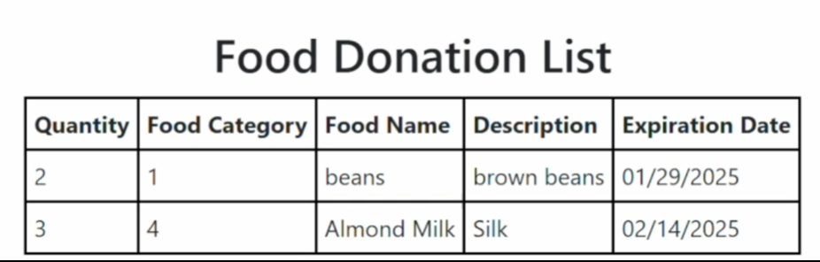
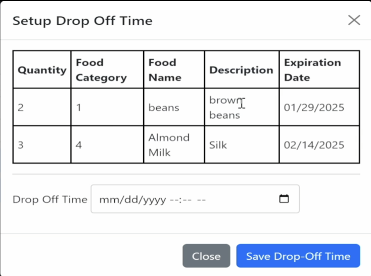
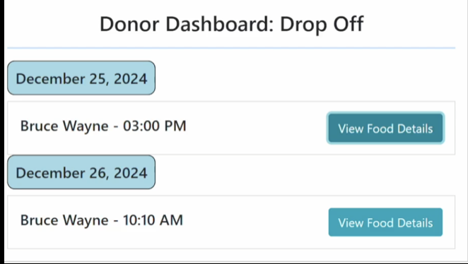
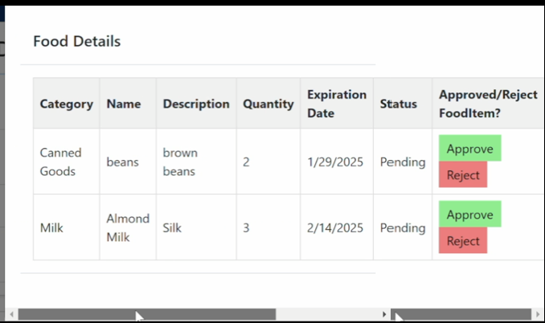

# Food Donations Made Easy
Problem:
- Food Insecurity
- Lack of Centralized Management System

Solution:
- Food Donation Tracking System

## Home Page
 


## Donor Dashboard


## Recipient Dashboard


## Admin Dashboard
- Food_to_Inventory
.png)


- Recipient Request Donation Status


## Code Implementation 

## Donor Dashboard

### Front-End Code

#### Food Donation Grid View
```xml
<asp:GridView ID="gvFoodItems" runat="server" AutoGenerateColumns="False" CssClass="gridview-style">
    <Columns>
        <asp:BoundField DataField="Quantity" HeaderText="Quantity" />
        <asp:BoundField DataField="FoodCategory" HeaderText="Food Category" />
        <asp:BoundField DataField="FoodName" HeaderText="Food Name" />
        <asp:BoundField DataField="Description" HeaderText="Description" />
        <asp:BoundField DataField="ExpirationDate" HeaderText="Expiration Date" DataFormatString="{0:MM/dd/yyyy}" HtmlEncode="false"/>
    </Columns>
</asp:GridView>
```

Output
<br>  
 


#### Food Donation Grid View in Modal
```xml
    <asp:GridView ID="gvModalFoodItem" runat="server" AutoGenerateColumns="False"  CssClass="gridview-style">
    <Columns>
        <asp:BoundField DataField="Quantity" HeaderText="Quantity" />
        <asp:BoundField DataField="FoodCategory" HeaderText="Food Category" />
        <asp:BoundField DataField="FoodName" HeaderText="Food Name" />
        <asp:BoundField DataField="Description" HeaderText="Description" />
        <asp:BoundField DataField="ExpirationDate" HeaderText="Expiration Date" DataFormatString="{0:MM/dd/yyyy}" HtmlEncode="false" />
    </Columns>
</asp:GridView>
<hr />
    <div class="mb-3">
        <label for="txtAppointmentTime" class="form-label">Drop Off Time</label>
        <asp:TextBox ID="txtdropoffDateTime" runat="server" TextMode="DateTimeLocal" style="width: 100%; padding: 10px; border: 1px solid #ccc; border-radius: 4px;"></asp:TextBox>
         <asp:Label ID=sucessMsg runat="server" CssClass="text-success"></asp:Label>
    </div>
```
Output
<br>  
 


### Backend Code

#### GetFoodTable method
- The GetFoodTable method is a helper method to store temporary FoodItem on the memory.

```csharp
private DataTable GetFoodTable()
{
    if (Session["FoodTable"] == null)
    {
        DataTable dt = new DataTable();
        dt.Columns.Add("Quantity", typeof(int));
        dt.Columns.Add("FoodCategory", typeof(string));
        dt.Columns.Add("FoodName", typeof(string));
        dt.Columns.Add("Description", typeof(string));
        dt.Columns.Add("ExpirationDate", typeof(DateTime));
        Session["FoodTable"] = dt;
    }
    return (DataTable)Session["FoodTable"];
}
```

#### btnAddFood_Click method
- The btnAddFood_Click method is an event handler that handles the process of inputting detailed food items of the user wanted to donate. So once you added the food item, it will display in two different grid views: the one in Dashboard and the other in “Drop Off Modal”.

```csharp
protected void btnAddFood_Click(object sender, EventArgs e)
{
    DataTable dt = GetFoodTable();

    DataRow dr = dt.NewRow();
    dr["Quantity"] = int.Parse(txtQuantity.Text);
    dr["FoodCategory"] = ddlCategories.SelectedValue;
    dr["FoodName"] = txtFoodName.Text;
    dr["Description"] = txtDescription.Text;
    dr["ExpirationDate"] = DateTime.Parse(txtExpiryDate.Text);
    if (dr["FoodCategory"] == null) // Validate category selection
    {
        lblMessage.CssClass = "text-danger";
        lblMessage.Text = "Please select a valid food category.";
        return;
    }
    dt.Rows.Add(dr);

    gvFoodItems.DataSource = dt; // for the main grid. 
    gvFoodItems.DataBind();


    gvModalFoodItem.DataSource = dt; // for modal grid
    gvModalFoodItem.DataBind();

    // Clear input fields
    txtQuantity.Text = "";
    ddlCategories.ClearSelection();
    txtFoodName.Text = "";
    txtDescription.Text = "";
    txtExpiryDate.Text = "";
}
```

#### SaveAppointmentClick method
- Then the last method called SaveAppointmentClick which is another type of event handler that handles the process of saving appointment-related data for food donations and their drop-off times and it also clears the temporary data in the memory since it is no longer needed.
  
```csharp
protected void SaveAppointment_Click(object sender, EventArgs e) 
  {
      DataTable dt = GetFoodTable();
      string dropoff_DateTime = txtdropoffDateTime.Text;

      foreach (DataRow row in dt.Rows) 
      {
          string query = "INSERT INTO FoodItems (Name, Description, ExpiryDate, DonorID, Quantity, DropOffDateTime, CategoryID) " +
                "VALUES (@Name, @Description, @ExpiryDate, @DonorID, @Quantity, @DropOffDateTime, @CategoryID)";
          int donorID = GetLoggedInUserID();
          int categoryID = Convert.ToInt32(row["FoodCategory"]);
          var parameters = new Dictionary<string, object>
          {
              { "@Name", row["FoodName"] },
              { "@Description", row["Description"] },
              { "@ExpiryDate", row["ExpirationDate"]  },
              { "@DonorID", donorID },
              { "@Quantity", row["Quantity"] },
              { "@DropOffDateTime", dropoff_DateTime},
              { "@CategoryID", categoryID }
          };

          DatabaseHelper.ExecuteTransactionalQuery(query, parameters);
          sucessMsg.Text = "Food Donation and Drop Off Time Saved!";


          // Clear session and GridView
          Session["FoodTable"] = null;
          gvFoodItems.DataSource = null;
          gvFoodItems.DataBind();

          gvModalFoodItem.DataSource = null; 
          gvModalFoodItem.DataBind();
      }
  }

```

## Recipient Dashboard

### Recipient Dashboard Grid View(Front-End Code)
```xml
<asp:GridView ID="gvAvailableFood" runat="server" AutoGenerateColumns="False" 
    OnRowCommand="gvAvailableFood_RowCommand" DataKeyNames="FoodItemID" 
    CssClass="gridview-style"> 
    <Columns>
        <asp:BoundField DataField="FoodItemID" HeaderText="Food Item ID" Visible="false" />
        <asp:BoundField DataField="Quantity" HeaderText="Quantity" />
        <asp:BoundField DataField="FoodCategory" HeaderText="Food Category" />
        <asp:BoundField DataField="FoodName" HeaderText="Food Name" />
        <asp:BoundField DataField="Description" HeaderText="Description" />
        <asp:BoundField DataField="ExpirationDate" HeaderText="Expiration Date" 
            DataFormatString="{0:MM/dd/yyyy}" HtmlEncode="false"/>
        <asp:ButtonField CommandName="Request" HeaderText="Request Food Item" Text="Request" ButtonType="Button" ControlStyle-CssClass="request-button"/>
    </Columns>
</asp:GridView>
```

Output
<br>  


### Back-End Code

#### gvAvailableFood_RowCommand event handler
- The event handler gridviewFood_RowCommand recives the data from request button then sends into two tables: request and food item.
- The first query is used to insert or update food requests for recipients identified by their unique IDs, ensuring the status is set to ‘Pending.
- The second query updates the status of a food item being requested in order to see the request in the admin dashboard. 

```csharp
protected void gvAvailableFood_RowCommand(object sender, GridViewCommandEventArgs e)
{
    if (e.CommandName == "Request")
    {
        // Get the logged-in user ID
        int? recipientID = GetLoggedInUserID();
        if (recipientID == null || recipientID <= 0)
        {
            lblError.Text = "You must be logged in to make a request.";
            lblError.Visible = true;
            return; // Exit the method
        }

        // Get the row index
        int rowIndex = Convert.ToInt32(e.CommandArgument);
        int foodItemID = Convert.ToInt32(gvAvailableFood.DataKeys[rowIndex]["FoodItemID"]);

        // Insert request with ON DUPLICATE KEY UPDATE
        string query = "INSERT INTO Requests (FoodItemID, RecipientID, Status) VALUES (@FoodItemID, @RecipientID, 'Pending') " +
                       "ON DUPLICATE KEY UPDATE Status = 'Pending'";

        var insertParams = new Dictionary<string, object>
        {
            { "@FoodItemID", foodItemID },
            { "@RecipientID", recipientID }
        };

        DatabaseHelper.ExecuteNonQuery(query, insertParams);

        // Update food item status
        string updateQuery = "UPDATE FoodItems SET Status = @status WHERE ID = @FoodItemID";
        var updateParams = new Dictionary<string, object>
        {
            { "@status", FoodStatus.Requested.ToString() },
            { "@FoodItemID", foodItemID }
        };

        DatabaseHelper.ExecuteNonQuery(updateQuery, updateParams);

        // Refresh the GridView
        LoadAvailableFood();
    }
}

```

#### LoadAvailableFood method
- The LoadAvailableFood method displays the available food items in the recipient dashboard.
  
```csharp
 private void LoadAvailableFood()
 {
     string query = @" 
                 SELECT 
                 fi.ID as FoodItemID, 
                  fc.Name AS FoodCategory,
                  fi.Name AS FoodName,
                  fi.Description as Description,
                  fi.Quantity as Quantity,
                  fi.ExpiryDate AS ExpirationDate,
                  fi.Status as Status 
            FROM 
                 fooditems fi 
        INNER JOIN  
                  foodcategories fc ON fi.CategoryID = fc.ID
         WHERE fi.Status = @status";

     // using Parameter queries, to avoid injection
     var parameters = new Dictionary<string, object>
     {
         { "@status", FoodStatus.Available.ToString() }
     };
      gvAvailableFood.DataSource = DatabaseHelper.ExecuteQuery(query, parameters);
     gvAvailableFood.DataBind();
 }
```

## Admin Dashboard

### Front-End Code

#### Donor Dashboard Drop Off View

```xml
<div class="dashboard_table">
    <asp:Panel ID="pnlDonorDashboard" runat="server" Width="100%">
        <h3 style="text-align: center;">Donor Dashboard: Drop Off</h3>
        <hr>
        <div id="appointmentsContainer">
            <div class="appointmentGroup">
                <asp:Label ID="lblNoAppointments" runat="server" Text="" Visible="false" />
                <asp:Repeater ID="rptTodayAppointments" runat="server">
                    <ItemTemplate>
                        <h4 class="appointmentDate"><%# Eval("AppointmentTime", "{0:MMMM dd, yyyy}") %></h4>
                        <div class="appointment">
                            <h5><%# Eval("DonorName") %> - <%# Eval("AppointmentTime", "{0:hh:mm tt}") %></h5>
                            <button type="button"
                                class="btn btn-info"
                                data-toggle="modal"
                                data-target="#foodDetailsModal"
                                onclick="showFoodDetails('<%# Server.HtmlEncode(Eval("SerializedFoodItems").ToString().Replace("'", "\\'")) %>')">
                                View Food Details
                            </button>
                        </div>
                    </ItemTemplate>
                </asp:Repeater>
            </div>
        </div>
    </asp:Panel>
</div>

```

Output
<br>  



#### Donor Dashboard Drop Off View(Modal)
```xml
<!-- Modal Structure -->
<div class="modal fade" id="foodDetailsModal" tabindex="-1" aria-labelledby="foodDetailsLabel" aria-hidden="true">
    <div class="modal-dialog">
        <div class="modal-content" id="foodDetailContent">
            <div class="modal-header">
                <h5 class="modal-title" id="foodDetailsLabel">Food Details</h5>
            </div>
            <div class="modal-body">
                <!-- This is where the food details will be populated dynamically -->
                <div id="foodDetailsContainer"></div>
            </div>
            <div class="modal-footer">
            </div>
        </div>
    </div>
</div>
```

Output
<br>  



### Back-End Code

#### LoadDropOffAppointment method
- The LoadDropOffAppointment method allows admin to see current and future appointments so they can plan accordingly.
```csharp
private void LoadDropOffAppointments()
  {
      string query = @"
      SELECT 
       u.Name AS DonorName,
      fi.ID as FoodItemID,
      fc.Name AS FoodCategory,
      fi.Name AS FoodName,
      fi.Description,
      fi.Quantity,
      fi.ExpiryDate AS ExpirationDate,
      fi.Status,
      fi.DropOffDateTime AS AppointmentTime
  FROM 
      FoodItems fi
  INNER JOIN 
      Users u ON fi.DonorID = u.ID
  INNER JOIN 
      FoodCategories fc ON fi.CategoryID = fc.ID
  WHERE
      fi.DropOffDateTime >= CURDATE() AND fi.Status = @Status
  ORDER BY
      fi.DropOffDateTime "; 
      var parameters = new Dictionary<string, object>
      {
          { "@status", FoodStatus.Pending.ToString() }
      };
```

#### LINQ Query
- This query both retrieves and categorizes relevant information about pending food items including the expiration date, quantity, and proposed drop-off date.
- The LINQ Query then groups in hierarchical information to emphasize the important details like DonorName and Drop off time so that it is easier to understand for the admin user and it binds back into the front end.
``` csharp

        // Implementing LINQ Structure because the data needs to be shown in front end is group hierarchally. 
      var result = DatabaseHelper.ExecuteQuery(query, parameters);
      // Group data by DonorName and AppointmentTime
      var groupedData = result.AsEnumerable()
                        .GroupBy(row => new
                        {
                            DonorName = row["DonorName"],
                            AppointmentTime = row["AppointmentTime"]
                        }).Select(group => new
                        {
                            DonorName = group.Key.DonorName,
                            AppointmentTime = group.Key.AppointmentTime,
                            FoodItems = group.Select(item => new
                            {
                                FoodCategory = item["FoodCategory"],
                                FoodName = item["FoodName"],
                                Description = item["Description"],
                                Quantity = item["Quantity"],
                                ExpirationDate = item["ExpirationDate"],
                                FoodItemID = item["FoodItemID"],
                                Status = item["Status"]
                            }).ToList(),  // to ensure it serializes into JSON
                            // Serialize the FoodItems as JSON and pass it to the UI
                            SerializedFoodItems = JsonConvert.SerializeObject(group.Select(item => new
                            {
                                FoodCategory = item["FoodCategory"],
                                FoodName = item["FoodName"],
                                Description = item["Description"],
                                Quantity = item["Quantity"],
                                ExpirationDate = item["ExpirationDate"],
                                FoodItemID = item["FoodItemID"],
                                Status = item["Status"]
                            }).ToList())
                        })
                        .ToList();// Ensure grouping is executed before serializing to JSON
     	      // Check if data is empty
  }
```

#### Edge Case
``` csharp
      if (groupedData.Count == 0)
      {
          // Show a label with a more detailed message if no appointments
          lblNoAppointments.Text = "There are no scheduled appointments today or in the future dates.";
          lblNoAppointments.Visible = true;  // Make the label visible
          rptTodayAppointments.Visible = false;  // Hide the Repeater
      }
      else
      {
          // Bind the data to the Repeater if available
          rptTodayAppointments.DataSource = groupedData;
          rptTodayAppointments.DataBind();
          lblNoAppointments.Visible = false;  // Hide the "No appointments" message
          rptTodayAppointments.Visible = true;  // Ensure the Repeater is visible
      }
```
