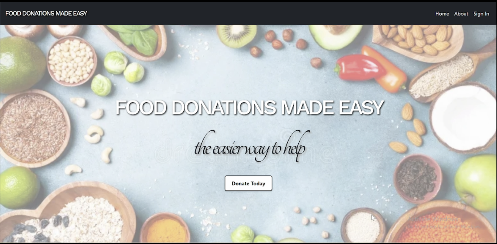
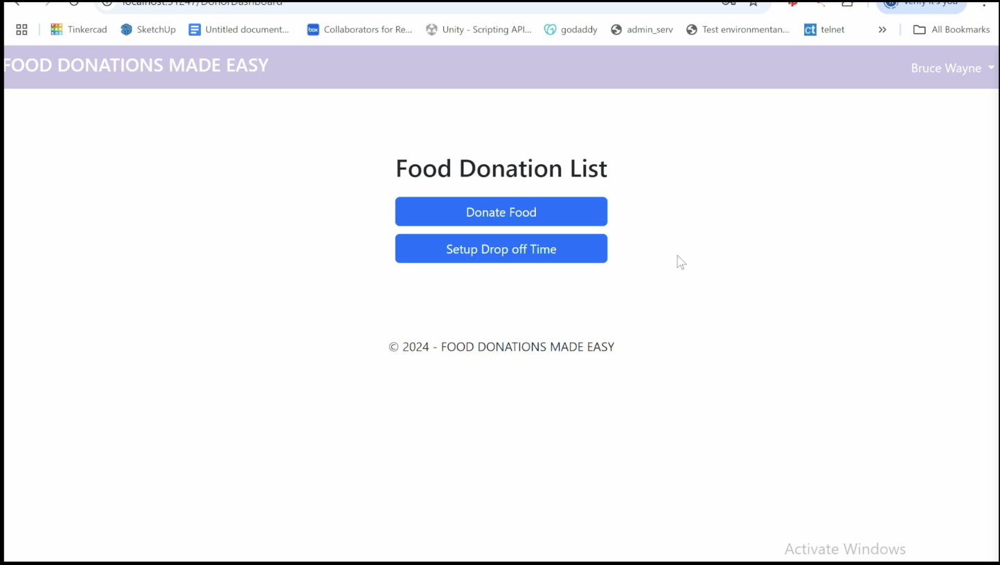
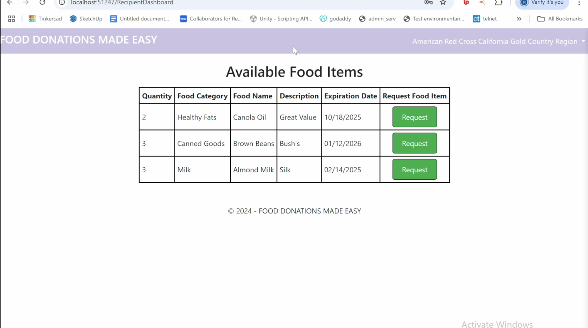
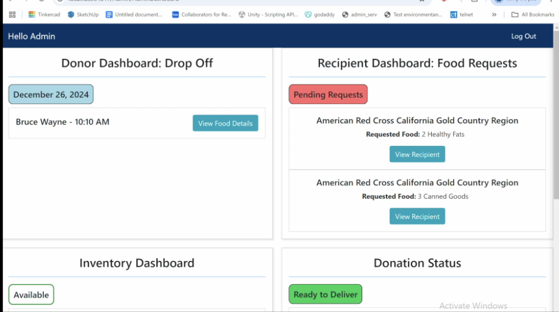

# Food Donations Made Easy
Problem:
- Food Insecurity
- Lack of Centralized Management System

Solution:
- Food Donation Tracking System

## Home Page
 


## Donor Dashboard



## Recipient Dashboard


## Admin Dashboard
- Food_to_Inventory
.png)


- Recipient Request Donation Status



## Code Snippets:
## Donor Dashboard
### Front-End Code 
- Food Donation Grid View
```xml
<asp:GridView ID="gvFoodItems" runat="server" AutoGenerateColumns="False" CssClass="gridview-style">
    <Columns>
        <asp:BoundField DataField="Quantity" HeaderText="Quantity" />
        <asp:BoundField DataField="FoodCategory" HeaderText="Food Category" />
        <asp:BoundField DataField="FoodName" HeaderText="Food Name" />
        <asp:BoundField DataField="Description" HeaderText="Description" />
        <asp:BoundField DataField="ExpirationDate" HeaderText="Expiration Date" DataFormatString="{0:MM/dd/yyyy}" HtmlEncode="false"/>
    </Columns>
</asp:GridView>
```

Image Output

- Food Donation Grid View in Modal
```xml
    <asp:GridView ID="gvModalFoodItem" runat="server" AutoGenerateColumns="False"  CssClass="gridview-style">
    <Columns>
        <asp:BoundField DataField="Quantity" HeaderText="Quantity" />
        <asp:BoundField DataField="FoodCategory" HeaderText="Food Category" />
        <asp:BoundField DataField="FoodName" HeaderText="Food Name" />
        <asp:BoundField DataField="Description" HeaderText="Description" />
        <asp:BoundField DataField="ExpirationDate" HeaderText="Expiration Date" DataFormatString="{0:MM/dd/yyyy}" HtmlEncode="false" />
    </Columns>
</asp:GridView>
<hr />
    <div class="mb-3">
        <label for="txtAppointmentTime" class="form-label">Drop Off Time</label>
        <asp:TextBox ID="txtdropoffDateTime" runat="server" TextMode="DateTimeLocal" style="width: 100%; padding: 10px; border: 1px solid #ccc; border-radius: 4px;"></asp:TextBox>
         <asp:Label ID=sucessMsg runat="server" CssClass="text-success"></asp:Label>
    </div>
```


### Backend Code
- The GetFoodTable method is a helper method to store temporary FoodItem on the memory.

```csharp
private DataTable GetFoodTable()
{
    if (Session["FoodTable"] == null)
    {
        DataTable dt = new DataTable();
        dt.Columns.Add("Quantity", typeof(int));
        dt.Columns.Add("FoodCategory", typeof(string));
        dt.Columns.Add("FoodName", typeof(string));
        dt.Columns.Add("Description", typeof(string));
        dt.Columns.Add("ExpirationDate", typeof(DateTime));
        Session["FoodTable"] = dt;
    }
    return (DataTable)Session["FoodTable"];
}
```

- The btnAddFood_Click method is an event handler that handles the process of inputting detailed food items of the user wanted to donate. So once you added the food item, it will display in two different grid views: the one in Dashboard and the other in “Drop Off Modal”.

```csharp
protected void btnAddFood_Click(object sender, EventArgs e)
{
    DataTable dt = GetFoodTable();

    DataRow dr = dt.NewRow();
    dr["Quantity"] = int.Parse(txtQuantity.Text);
    dr["FoodCategory"] = ddlCategories.SelectedValue;
    dr["FoodName"] = txtFoodName.Text;
    dr["Description"] = txtDescription.Text;
    dr["ExpirationDate"] = DateTime.Parse(txtExpiryDate.Text);
    if (dr["FoodCategory"] == null) // Validate category selection
    {
        lblMessage.CssClass = "text-danger";
        lblMessage.Text = "Please select a valid food category.";
        return;
    }
    dt.Rows.Add(dr);

    gvFoodItems.DataSource = dt; // for the main grid. 
    gvFoodItems.DataBind();


    gvModalFoodItem.DataSource = dt; // for modal grid
    gvModalFoodItem.DataBind();

    // Clear input fields
    txtQuantity.Text = "";
    ddlCategories.ClearSelection();
    txtFoodName.Text = "";
    txtDescription.Text = "";
    txtExpiryDate.Text = "";
}
```

- Then the last method called SaveAppointmentClick which is another type of event handler that handles the process of saving appointment-related data for food donations and their drop-off times and it also clears the temporary data in the memory since it is no longer needed. 
```csharp
protected void SaveAppointment_Click(object sender, EventArgs e) 
  {
      DataTable dt = GetFoodTable();
      string dropoff_DateTime = txtdropoffDateTime.Text;

      foreach (DataRow row in dt.Rows) 
      {
          string query = "INSERT INTO FoodItems (Name, Description, ExpiryDate, DonorID, Quantity, DropOffDateTime, CategoryID) " +
                "VALUES (@Name, @Description, @ExpiryDate, @DonorID, @Quantity, @DropOffDateTime, @CategoryID)";
          int donorID = GetLoggedInUserID();
          int categoryID = Convert.ToInt32(row["FoodCategory"]);
          var parameters = new Dictionary<string, object>
          {
              { "@Name", row["FoodName"] },
              { "@Description", row["Description"] },
              { "@ExpiryDate", row["ExpirationDate"]  },
              { "@DonorID", donorID },
              { "@Quantity", row["Quantity"] },
              { "@DropOffDateTime", dropoff_DateTime},
              { "@CategoryID", categoryID }
          };

          DatabaseHelper.ExecuteTransactionalQuery(query, parameters);
          sucessMsg.Text = "Food Donation and Drop Off Time Saved!";


          // Clear session and GridView
          Session["FoodTable"] = null;
          gvFoodItems.DataSource = null;
          gvFoodItems.DataBind();

          gvModalFoodItem.DataSource = null; 
          gvModalFoodItem.DataBind();
      }
  }

```

## Recipient Dashboard

### Recipient Dashboard Grid View(Front-End Code)
```xml
<asp:GridView ID="gvAvailableFood" runat="server" AutoGenerateColumns="False" 
    OnRowCommand="gvAvailableFood_RowCommand" DataKeyNames="FoodItemID" 
    CssClass="gridview-style"> 
    <Columns>
        <asp:BoundField DataField="FoodItemID" HeaderText="Food Item ID" Visible="false" />
        <asp:BoundField DataField="Quantity" HeaderText="Quantity" />
        <asp:BoundField DataField="FoodCategory" HeaderText="Food Category" />
        <asp:BoundField DataField="FoodName" HeaderText="Food Name" />
        <asp:BoundField DataField="Description" HeaderText="Description" />
        <asp:BoundField DataField="ExpirationDate" HeaderText="Expiration Date" 
            DataFormatString="{0:MM/dd/yyyy}" HtmlEncode="false"/>
        <asp:ButtonField CommandName="Request" HeaderText="Request Food Item" Text="Request" ButtonType="Button" ControlStyle-CssClass="request-button"/>
    </Columns>
</asp:GridView>
```
Image Output:


### Back-End Code

```csharp
protected void gvAvailableFood_RowCommand(object sender, GridViewCommandEventArgs e)
{
    if (e.CommandName == "Request")
    {
        // Get the logged-in user ID
        int? recipientID = GetLoggedInUserID();
        if (recipientID == null || recipientID <= 0)
        {
            lblError.Text = "You must be logged in to make a request.";
            lblError.Visible = true;
            return; // Exit the method
        }

        // Get the row index
        int rowIndex = Convert.ToInt32(e.CommandArgument);
        int foodItemID = Convert.ToInt32(gvAvailableFood.DataKeys[rowIndex]["FoodItemID"]);

        // Insert request with ON DUPLICATE KEY UPDATE
        string query = "INSERT INTO Requests (FoodItemID, RecipientID, Status) VALUES (@FoodItemID, @RecipientID, 'Pending') " +
                       "ON DUPLICATE KEY UPDATE Status = 'Pending'";

        var insertParams = new Dictionary<string, object>
        {
            { "@FoodItemID", foodItemID },
            { "@RecipientID", recipientID }
        };

        DatabaseHelper.ExecuteNonQuery(query, insertParams);

        // Update food item status
        string updateQuery = "UPDATE FoodItems SET Status = @status WHERE ID = @FoodItemID";
        var updateParams = new Dictionary<string, object>
        {
            { "@status", FoodStatus.Requested.ToString() },
            { "@FoodItemID", foodItemID }
        };

        DatabaseHelper.ExecuteNonQuery(updateQuery, updateParams);

        // Refresh the GridView
        LoadAvailableFood();
    }
}

```


